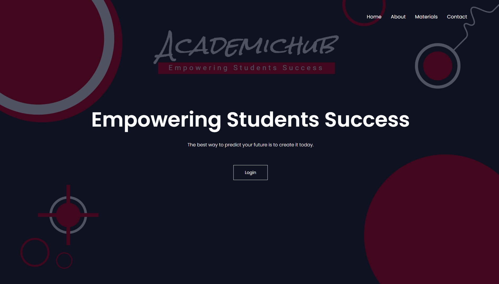

# Academic-Hub

Our project is a comprehensive web application designed to support students preparing for examinations at our college, with a specific focus on the AKTU examination system. The application features a user-friendly interface with secure authentication, providing access to a wide range of study materials, including notes, previous year questions (PYQs), and important questions categorized by semester and year.

__Key Features__ :-  
  
  1. __User Authentication:__ Our platform ensures secure access with user authentication, allowing only registered users to utilize the resources.

1. __Study Materials:__ Students can access high-quality notes, PYQs, and important questions tailored for AKTU and college examinations, categorized by semester and year.

1. __Admin Panel:__ The application includes an admin panel for managing user accounts and content, ensuring smooth operation and content organization.

1. __Responsive Design:__ With a responsive design, our platform offers seamless access across devices, enabling students to study anytime, anywhere.

__Future Enhancements:__  
In the future, we plan to expand the platform by adding more study materials, implementing a login and sign-up page, introducing a teacher panel for direct note sharing, incorporating a review system and feedback mechanism, and implementing measures to prevent cheating.

__Mission Statement:__  
Our mission is to empower students on their academic journey by providing them with a centralized platform for accessing high-quality study materials and resources, ultimately enhancing their academic success and overall learning experience.

## Authors

- [@Shivansh Gupta](https://www.github.com/Shiavnsh-04)

## Screenshots

